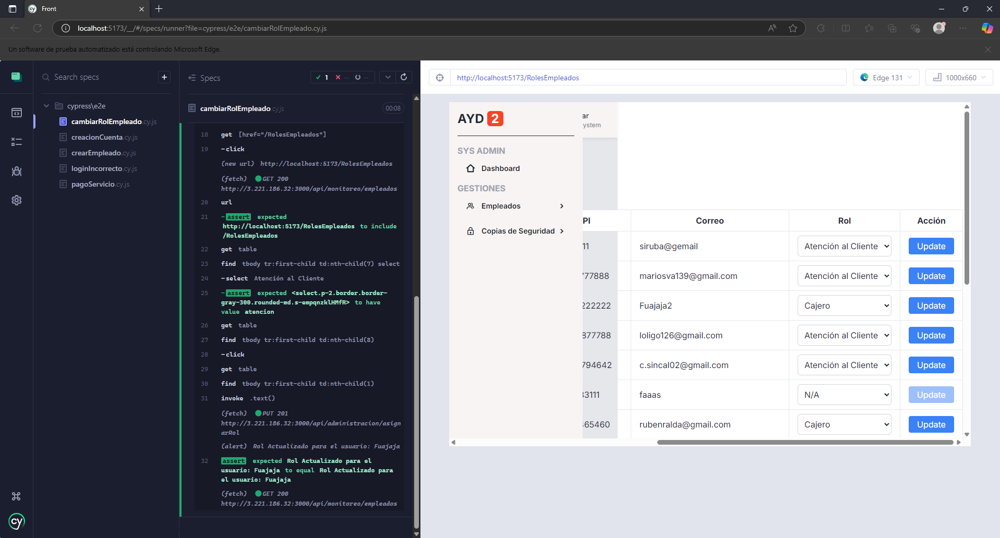

## Pruebas de Aceptación
Para el desarrollo de las pruebas de aceptación se realizaron grabaciones de la aplicación, abarcando los que se consideran que cubren algunos de los casos de uso más importantes del proyecto:

### CDU - Inicio de Sesion
Permite a los empleados entrar a la plataforma.
https://drive.google.com/file/d/1evysGhNjpwyd8mcINeyJbtRxZaSoODZA/view?usp=drive_link

### CDU - Registro de empleados
Los empleados pueden registrarse como usuarios del sistema.
https://drive.google.com/file/d/1Gczhnh8sHLw_S-AMLLzOro5u0QTKQH8Z/view?usp=drive_link

A continuación se muestra el correo obtenido del registro del empleado:


### CDU - Solicitud cuenta
Opcion donde los clientes realizan la solicitud de cuentas.
https://drive.google.com/file/d/1XPdcuMJUxAGdWzm7u7S--JFNCK9IKega/view?usp=drive_link


### CDU - Monitoreo Actividades
Los Supervisores ven en tiempo real las actividades de los empleados.
https://drive.google.com/open?id=1Si7c22kOt2Cy5QZm9pc6XJB420s3DdOk&usp=drive_copy

### CDU - Copia de seguridad
Los Administradores de sistemas generan copias de seguridad.
https://drive.google.com/file/d/1-TFVwRgdCQh5PmT0lWxvJ8zAtVvDBUWK/view?usp=drive_link

## Pruebas No Funcionales

### PRUEBAS DE SEGURIDAD

Para el desarrollo de las pruebas de seguridad se utilizaron herramientas como `nmap` y `Metasploit` para hacer diferentes escaneos de vulnerabilidades y pruebas de explosion de vulnerabilidades.

Escaneos y ejecucion de Scripts:


Para las pruebas de explotacion se intento la filtracion de informacion u archivos por medio de ftp anonimo, dando resultados negativos.


Otra prueba fue el acceso por medio de fuerza bruta a la conexion ssh evaluando la seguridad del servidor donde se aloja la aplicacion, dando resultados negativos.


### PRUEBAS DE RENDIMIENTO

Para la evaluacion del rendimiento del aplicativo se utilizo la herramienta de Grafana `k6`, con el siguiente script que simulo 100 usuarios virtuales realizando logins y consultando cuentas, dando resultados bastantes positivos en el rendimiento del aplicativo.

```js
import http from 'k6/http';
import { check, sleep } from 'k6';

// Configuración de las pruebas
export const options = {
  vus: 100, // Número de usuarios virtuales
  duration: '30s', // Duración de la prueba
  thresholds: {
    http_req_duration: ['p(95)<2000'], // El 95% de las solicitudes deben completarse en menos de 2s
    http_req_failed: ['rate<0.01'], // Menos del 1% de las solicitudes deben fallar
  },
};

const endpoints = [
  { method: 'GET', url: 'http://3.221.186.32:3000/api/gestion/cuenta/1' },
  { method: 'POST', url: 'http://3.221.186.32:3000/api/administracion/login', body: JSON.stringify({ usuario: 'Fuajaja2', password: '7A4qo_8j=<7EP0fe'}), params: { headers: { 'Content-Type': 'application/json' } } },
];

export default function () {
  const endpoint = endpoints[Math.floor(Math.random() * endpoints.length)];
  const res = http.request(endpoint.method, endpoint.url, endpoint.body, endpoint.params);
  check(res, {
    'status es 200': (r) => r.status === 200 || r.status === 201 ,
    'respuesta no vacía': (r) => r.body && r.body.length > 0,
  });
  sleep(Math.random() * 2);
}

```


### PRUEBAS DE INYECCIÓN SQL

Para las pruebas de inyeccion de SQL se utilizo la herramienta de `sqlmap` donde se realizaron pruebas en el endpoint de `login`, que en la teoria es uno de las llamadas mas propensas a una inyeccion SQL, al intentar hacer un login y acceder a funcionalidades no permitidas haciendo pruebas con el parametro de usuario y el parametro de password, los resultados se muestran acontinuacion determinando que los parametros en el body de la llamada estan bien asegurados frente a inyecciones SQL.

```bash
python3 sqlmap.py -u "http://3.221.186.32:3000/api/administracion/login" \ 
--data '{"usuario": "Fuajaja2", "password": "123"}' \
--method POST \
--dbms mysql -p password \
--batch \
--level=2 \
--risk=3
```


```bash
python3 sqlmap.py -u "http://3.221.186.32:3000/api/administracion/login" \ 
--data '{"usuario": "admin", "password": "-4x::m>m4LP>X$rf"}' \
--method POST \
--dbms mysql -p password \
--batch \
--level=2 \
--risk=3
```


### PRUEBAS DE USABILIDAD

Para las pruebas de usabilidad se definio un proceso dentro del aplicativo `lookback` donde se diseñaron pruebas `Self Test` que son sesiones en vivo por parte de los usuarios donde estos tienen un tiempo determinado para testar el aplicativo, estas pruebas son grabadas y posteriormente evaluadas para determinar la usabilidad y puntos de mejora de la aplicacion.

Se realizaron dos pruebas en 2 dispositivos diferentes de diferentes usuarios.


Web Android:


Web Windows:


Obteniendo los siguientes resultados:


Obteniendo la retroalimentacion se determino que el aplicativo tiene muchos puntos de mejora en dispositivos moviles ya que no deja al usuario interactuar con la aplicacion.

Mientras que con una PC, la aplicacion funciona de muy buena manera y es accesible para los usuarios.

## Pruebas E2E

### Cambiar el rol de un usuario

Inicia sesión como administrador
~~~js
cy.visit('/');
cy.get('#email').type('Iskandar');
cy.get('#pass').type('9:DxD}O=X<m,u5Nl');
cy.get('#role').select('Administrador');

cy.get('form').submit();

cy.get('[accept=".ayd"]').attachFile('IskandarKey.ayd');

cy.contains('Subir y Continuar').click();
~~~

Selecciona el menú para cambiar el rol del empleado
~~~js
// Expandir el menú
cy.get('main').find('button').first().click();

cy.get('[href="/RolesEmpleados"]').click();
cy.url().should('include', '/RolesEmpleados');
~~~

Obtiene la primera fila de la tabla y cambia el rol
~~~js
cy.get('table')
.find('tbody tr:first-child td:nth-child(7) select')
.select('Atención al Cliente')
.should('have.value', 'atencion'); // Verifica que el valor se cambió

cy.get('table')
.find('tbody tr:first-child td:nth-child(8)')
.click()

cy.get('table') // Selecciona el input por ID
.find('tbody tr:first-child td:nth-child(1)')
.invoke('text') // Obtiene el valor del atributo "value"
.then((valor) => {
  // Interceptar la alerta
  cy.on('window:alert', (alertText) => {
    expect(alertText).to.equal(`Rol Actualizado para el usuario: ${valor}`);
  });
});
~~~
Ejecución de la prueba


### Creación de una cuenta

Inicio de sesión de un empleado con rol de atención al client
~~~js
cy.visit('/');
cy.get('#email').type('userAtencion');
cy.get('#pass').type('_6-YV[$ow$|{xA4#');
cy.get('#role').select('usuario');
cy.get('form').submit();
~~~
Selección del menú
~~~js
// Expandir el menú
cy.get('main').find('button').first().click();

cy.get('[href="/CuentaQ"]').click();

cy.url().should('include', '/CuentaQ');
~~~
Subir la información del cliente
~~~js
cy.get('[placeholder="Nombre"]').type(cliente.nombre);
cy.get('[placeholder="Apellido"]').type(cliente.apellido);
cy.get('[placeholder="CUI"]').type(cliente.cui);
cy.get('[placeholder="Teléfono"]').type(cliente.telefono);
cy.get('[placeholder="Correo"]').type(cliente.correo);
cy.get('[placeholder="Edad"]').type(cliente.edad);
cy.contains('Seleccione género').parent().select(cliente.genero);
cy.get('[placeholder="Dirección"]').type(cliente.direccion);

cy.get('#file-input').attachFile(cliente.foto);

cy.contains('Siguiente').click();
~~~
Subir la información de la cuenta
~~~js
cy.get('#tipo-cuenta').select(cliente.tipoCuenta);
cy.get('#pregunta-seguridad').select(cliente.preguntaSeguridad);
cy.get('#monto').type(cliente.monto);
cy.get('#respuesta').type(cliente.respuesta);
~~~
Enviar la información y validar el mensaje si se creó correctamente
~~~js
// Interceptar la alerta
cy.on('window:alert', (alertText) => {
  expect(alertText).to.equal('Cuenta completa creada exitosamente');
});

cy.contains('Submit').click();
~~~
Ejecución de la prueba


### Creación de un empleado

Iniciar sesión como administrador
~~~js
cy.visit('/');
cy.get('#email').type('Iskandar');
cy.get('#pass').type('9:DxD}O=X<m,u5Nl');
cy.get('#role').select('Administrador');

cy.get('form').submit();

cy.get('[accept=".ayd"]').attachFile('IskandarKey.ayd');

cy.contains('Subir y Continuar').click();
~~~

Ir al menú
~~~js
// Expandir el menú
cy.get('main').find('button').first().click();

cy.get('[href="/CreateEmpleado"]').click();

cy.url().should('include', '/CreateEmpleado');
~~~
Se cargan los datos
~~~js
cy.get('#nombres').type(empleado.nombres);
cy.get('#apellidos').type(empleado.apellidos);
cy.get('#edad').type(empleado.edad);
cy.get('#dpi').type(empleado.dpi);
cy.get('#telefono').type(empleado.telefono);
cy.get('#usuario').type(empleado.usuario);
cy.get('#correo').type(empleado.correo);
cy.get('#genero').select(empleado.genero);
cy.get('#estadoCivil').select(empleado.estadoCivil);

cy.contains('Subir foto ').find('input').first().attachFile(empleado.foto)
cy.contains('Subir firma ').find('input').first().attachFile(empleado.firma)
cy.contains('Subir papelería ').find('input').first().attachFile(empleado.papeleria)
~~~
Se envía y verifica el mensaje correcto
~~~js
cy.contains('Crear Usuario').click()

// Interceptar la alerta
cy.on('window:alert', (alertText) => {
  expect(alertText).to.equal('Usuario creado exitosamente');
});
~~~
Ejecución de la prueba


### Inicio de sesión incorrecto

Ingreso de credenciales falsas
~~~js
cy.visit('/');
cy.get('#email').type('Pa123');
cy.get('#pass').type('NoExiste123');
cy.get('#role').select('usuario');
~~~
Captura del mensaje
~~~js
cy.on('uncaught:exception', (text) => {
  expect(text).to.equal('Error en las credenciales del para el tipo de usuario: usuario');
});
cy.get('form').submit();
~~~
Ejecución de la prueba


### Pago de un servicio

Inicio de sesión como cajero
~~~js
cy.visit('/');
cy.get('#email').type('userAtencion');
cy.get('#pass').type('_6-YV[$ow$|{xA4#');
cy.get('#role').select('usuario');
cy.get('form').submit();
~~~
Abriendo el menú
~~~js
// Expandir el menú
cy.get('main').contains('Gestiones').parent().click();

cy.get('[href="/PagoServicios"]').click();
~~~
Cargando los datos
~~~js
cy.get('#cuentaUsuario').type(servicio.noCuenta);
cy.get('#servicioSeleccionado').select(servicio.servicio);
cy.get('#montoAPagar').type(servicio.monto);
~~~
Comparando el mensaje correcto
~~~js
cy.contains('Realizar Gestión').click()
// Interceptar la alerta
cy.on('window:alert', (alertText) => {
  expect(alertText).to.equal('Servicio pagado exitosamente');
});
~~~
Ejecución de la prueba
