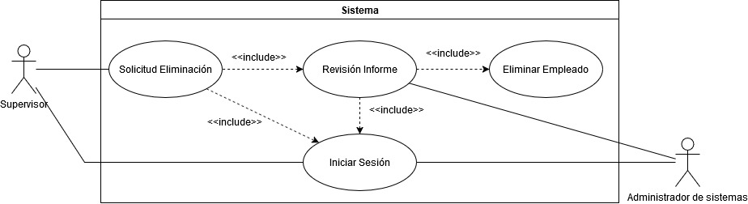
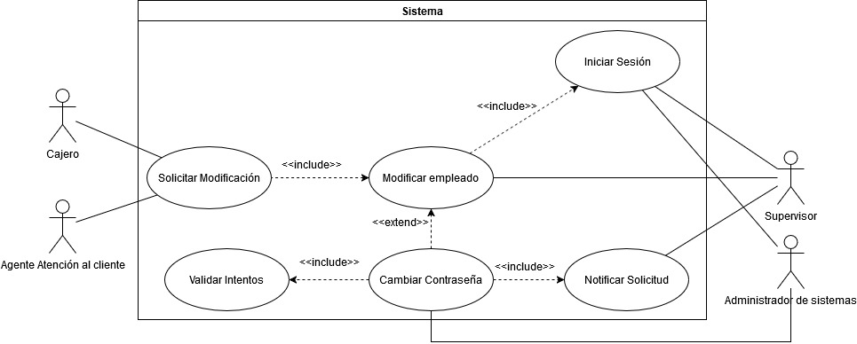
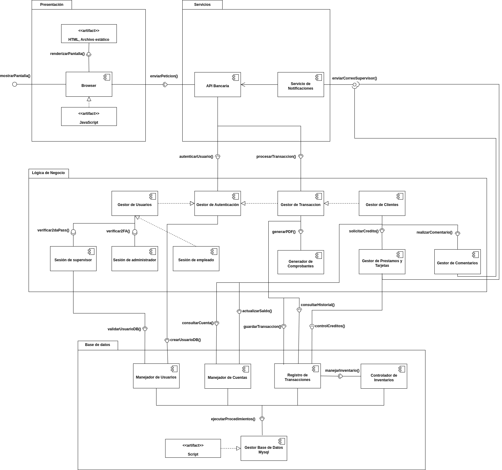
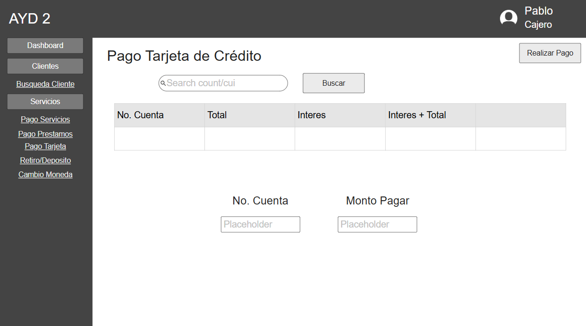
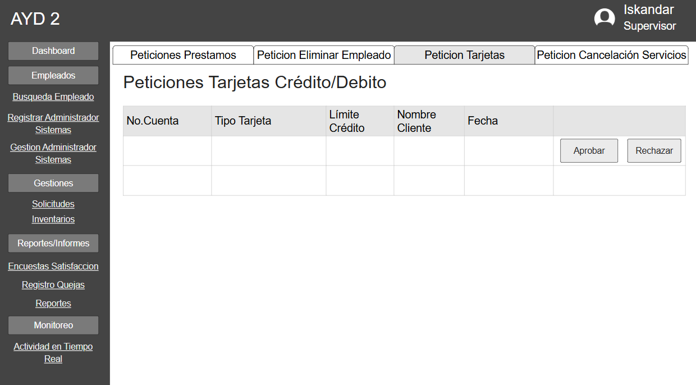

# Manual Técnico

## Antecedentes
Para la plataforma propuesta para el banco Money Bin, este busca el abordar las problemáticas que tiene mediante la integración de tecnologías avanzadas, utilizando un diseño de sistema que sea escalable y seguro tanto para el personal como para los usuarios clientes que utilizan los servicios; y tambienen la entrega de la experiencia del usuario para fomentar la confianza y la fidelización de los clientes con el banco. Resolviendo los desafios para poder posicionar al banco como una referencia en la innovación financiera.

### Contexto del proyecto 
Para un entorno en donde las tecnológica se están transformando, la forma en la que los clientes interactúan con los servicios financieros, Money Bin busca la implementación de una plataforma que no solo automatice dichos procesos internos, sino que tambien le brinde a los usuarios una experiencia de usuario que sea eficiente y fluida; implicando lo que es la creación de una solución tecnológica que sea escalable, segura y adaptable, atendiendo tanto a los usuarios como a la empresa (banco), mejorando así mismo la accesibilidad y la personalización de los servicios financieros.

### Visión y Misión
* **_Misión:_** Brindar y fortalecer la confianza de los clientes facilitando el acceso a servicios escenciales con un enfoque en la innovación, simplicidad y eficiencia operativa. Nos alineamos con los valores del banco y nos comprometemos a fomentar la inclusión fnanciera mientras nos esforzarmos por convertirnos en un líder financiero en el país.
 

* **_Visión:_** Ser el banco más confiable y accesible de Guatemala, destacándonos por nuestra capacidad para inspirar a nuestro equipo para que cada uno de lo mejor de sí, creando una experiencia de cliente excepcional y estalbeciendo un estándar de excelencia e innovación en el sector económico.
 

### Raíz de la Problemática
Hoy en día, para el sector financiero, este enfrenta varios desafíos relacionados en lo que es la transformación digital y las expectativas cambiantes de los usuarios, los cuales entran los siguientes puntos:

* **_Inclusión financiera Limitada:_** Una parte de la población y pequeñas empresas no tienen accesos a lo que son los servicios financieros básicos debido a las barreras como la falta de la infraestructura, costos elevados y procesos complejos.
* **_Falta de personalización:_** La mayoría de plataformas bancarias tradicionales carecen o no tienen la flexibilidad para ofrecer servicios personalizados que se puedan adaptar a las necesidades de cada cliente.
* **_Sistemas obsoletos:_** Las tecnologías heredadas y los sistemas internos anticuados, dan lugar a dificultades de agilidad y escalabilidad necesarias para adaptarse a las demandas actuales y a las posteriores que pueden haber en el mercado.
* **_Segudiad y Confianza:_** El aumento en lo que son los ciberataques y las crecientes preocupaciones de la privacidad de los datos del usuario, hacen imprescindible la implementación de medidas robustas para proteger la información de los usuarios.
* **_Segudiad y Confianza:_** Con la entrada de nuevas tecnologias, los bancos tradicionales enfrentan una presión creciente a la hora de innovar y mantenerse competitivos en términos de experiencia de usuario y eficiencia operativa.

### Objetivos

#### Generales
* Crear una plataforma que garantice la escalabilidad, serguridad y facilidad de uso.
* Proveer soluciones financieras para reforzar la confianza y satisfacción de los clientes.
* Contribuir al crecimiento económico de los usuarios mediante servicios innovadores.

#### Especificos
* Diseñar una solución escalable y adaptable que permita el crecimiento continuo.
* Implementar tecnologías para asegurar la protecicón de los datos y de las transacciones.
* Mejorar la accesibilidad y personalización de los servicios financieros.
* Establecer procesos claves que sean eficientes para la automatización de operaciones bancarias.

## Core del negocio
Money Bin es una institución financiera líder en Guatemala, enfocada en promover y contribuir al crecimiento económico de sus clientes con una amplia gama de servicios bancarios mediante la implementación de una plataforma bancaria sostenible, escalable y adaptable a lo largo del tiempo, enfocándose en pilares fundamentales como la seguridad, eficiencia e innovación, permitiendo que más usuarios accedan a los servicios financieros que antes les podría parecer inaccesibles, buscando solucionar y mejorar la experiencia de los mismos.

### Problema
A pesar de contar con una sólida reputación y una red de sucursales que abarca todo el territorio de Guatemala, Money Bin está teniendo grandes desafíos operativos y de seguridad, los cuáles generan un impacto negativo en la experiencia del cliente y en la carga de trabajo de sus empleados, afectando a los planes a mediano y largo plazo del crecimiento de la institución.

### Problemas del problema
Al profundizar en el problema se puede determinar que:
* El enfoque actual de la empresa respecto a su evolución a lo largo del tiempo no es el adecuado, generando un impacto en la calidad de vida de la institución y que se ve reflejado en la situación actual.
* Los procesos para aprovechar cada uno de los servicios que ofrece Money Bin no son lo suficientemente accesibles, intuitivos y personalizables para generar un interés en nuevos usuarios.
* El sistema utilizado por los empleados de Money Bin no está optimizado para controlar un volumen alto de transacciones del día a día en sus sucursales, provocando una pérdida de confianza en los clientes actuales.

## CDU de alto nivel

## Primer descomposición del CDU de alto nivel

## Lista de requerimientos funcionales generales

Nomenclatura:
- RF: requisito funcional.
- RNF: requisito no funcional.

### Requerimientos funcionales rol cajero

|No. Requisito|Nombre del requisito|Descripción|Actor|Medio|Proceso asociado|
|-------------|--------------------|-----------|-------|-----|----------------|
|RF-01| Ingreso a la plataforma | El sistema debe permitir el ingreso a la plataforma con el correo y contraseña o utilizando un nombre de usuario. | Personal asignado con el rol de cajero y atención al cliente | Pantalla | Manejo de usuarios
|RF-02| Pago de servicios básicos | El sistema debe permitir al cajero realizar pagos de servicios básicos de los clientes (agua, luz, teléfono, internet) ingresando el nombre, código de servicio y monto. | Personal asignado con el rol de cajero| Pantalla | Pagos
|RF-04| Pago de préstamos | El sistema debe permitir al cajero realizar pagos parciales o totales de préstamos de un cliente ingresando número de cuenta, número de préstamo, monto y fecha de pago. | Personal asignado con el rol de cajero | Pantalla | Pagos |
|RF-05| Búsqueda por cuenta o CUI | El cajero debe poder buscar clientes ingresando el número de cuenta o CUI y visualizar detalles de perfil e historial de transacciones. | Personal asignado con el rol de cajero | Pantalla | Consultas |
|RF-06| Mostrar saldo | El cajero debe poder visualizar el saldo actual y la fecha de la última actualización del saldo de un empleado o cliente. | Personal asignado con el rol de cajero | Pantalla | Consultas |
|RF-07| Cambio de moneda | El sistema debe permitir al cajero realizar cambios de moneda a los clientes de quetzales a dólares con el No. de cuenta. | Personal asignado con el rol de cajero | Pantalla | Transacciones |
|RF-08| Generación de comprobante | El sistema debe generar comprobantes en formato PDF para cada transacción realizada por el cajero incluyendo número de cuenta, tipo de transacción, fecha y hora, monto y nombre con firma digital del empleado. | Personal asignado con el rol de cajero | Sistema | Reportes |
|RF-09| Retiro de dinero | El cajero debe poder hacer retiros de una cuenta bancaria ingresando el número de cuenta del cliente, monto, fecha y hora, tipo de cuenta, tipo de moneda y si es monetario o ahorro.  | Personal asignado con el rol de cajero | Pantalla | Transacciones |
|RF-10| Depósito de dinero | El cajero debe poder realizar depósitos a una cuenta bancaria ingresando número de cuenta, monto, fecha y hora, tipo de cuenta, tipo de moneda y si es monetario o ahorro. | Personal asignado con el rol de cajero | Pantalla | Transacciones |
|RF-11| Moneda en transacciones | El sistema debe permitir realizar transacciones en dólares o quetzales si la cuenta si el modulo esta activo | Personal asignado con el rol de cajero | Pantalla | Transacciones
|RF-12| Pago de tarjeta de crédito | El sistema debe permitir al cajero realizar el pago de la tarjeta de crédito al cliente. | Personal asignado con el rol de cajero | Pantalla | Pagos
|RF-13| Cobro de la tarjeta de crédito | El sistema debe cobrar mensualmente a los clientes con tarjeta de crédito Q75.00 y si no paga a tiempo su deuda también se agregará un monto de interés simple del 5% de su deuda. | Cliente | Sistema | Pagos
|RF-14| Limite de cambio de moneda | El sistema debe validar que el cliente no supere el límite de cambio al día | Cliente | Sistema | Transacciones
|RF-15| Validaciones retiro de dinero | El sistema debe implementar límites de retiro y validaciones de identidad del cliente | Cliente | Sistema | Transacciones

### Requerimientos funcionales rol atención al cliente

|No. Requisito|Nombre del requisito|Descripción|Actor|Medio|Proceso asociado|
|-------------|--------------------|-----------|-------|-----|----------------|
| RF-16 | Apertura de cuentas | El sistema debe permitir abrir cuentas de ahorro o monetarias ingresando la información personal del cliente, el tipo de cuenta, una pregunta de seguridad, monto, fecha y hora | Personal asignado con el rol de atención al cliente | Pantalla | Manejo de cuenta
| RF-17 | Validacion No. cuenta | El sistema debe validar la identidad del cliente y generar un número de cuenta único. | Sistema | Sistema | Manejo de cuenta
| RF-18 | Actualización datos del cliente | El sistema debe permirir al personal de atención al cliente actualizar su información personal ingresando el número de cuenta fecha y hora de actualización y la verificación de identidad. | Personal asignado con el rol de atención al cliente | Pantalla | Manejo de cuenta
| RF-19 | Historial de cambios | El sistema debe guardar un historial de todos los cambios en la información personal que se realicen del cliente | Personal asignado con el rol atención al cliente | Pantalla | Reportes
| RF-20 | Solicitud de tarjetas | El sistema debe permitir al personal de atención al cliente realizar la solicitud de nuevas tarjetas de crédito o débito incluyendo la información según las políticas del banco | Personal asignado con el rol atención al cliente | Pantalla | Manejo de cuenta
| RF-21 | Manejo de solicitudes de nuevas tarjetas | El sistema debe tener la opción a los supervisores de ver las solicitudes de nuevas tarjetas y de cambiar el estado de las mismas. | Supervisores | Pantalla | Manejo de cuenta
| RF-22 | Bloqueo de tarjetas | El sistema debe permitir al personal de atención al cliente bloquear tarjetas ingresando la información requerida | Personal asignado con el rol atención al cliente | Pantalla | Manejo de cuenta
| RF-23 | Notificación de bloqueos | El sistema debe notificar por correo electrónico sobre el bloque de tarjetas. | Equipo de fraude, cliente | Sistema | Manejo de cuenta
| RF-24 | Reporte de fraude | El sistema debe generar un reporte automático de bloqueos de tarjetas | Equipo de fraude | Sistema | Reportes
| RF-25 | Solicitud cancelación de servicios | El sistema debe permitir al personal de atención al cliente generar la solicitud de cancelación de servicios o productos financieros | Personal asignado con el rol atención al cliente  | Pantalla | Manejo de cuenta
| RF-26 | Manejo de solicitudes de cancelación de servicios | El sistema debe mostrar el saldo o deudas pendientes en la solicitud y permitir al supervisor ver las solicitudes y cambiar el estado de las mismas | Supervisores | Pantalla | Manejo de cuenta
| RF-27 | Apertura de cuenta en dólares | El sitema debe permitir al personal de atención al cliente la apertura de cuentas en moneda dólar como alternativa. | Personal asignado con el rol atención al cliente | Pantalla | Manejo de cuenta
| RF-28 | Encuentas de satisfacción | El sistema debe permitir al personal de atención al cliente realizar una encuesta de satisfacción a los clientes por cada trámite realizado. | Personal asignado con el rol atención al cliente  | Pantalla | Manejo de cuenta
| RF-29 | Solicitud de préstamos | El sistema debe permitir al personal de atención al cliente ingresar solicitudes de préstamos personales, hipotecarios, vehiculares u otros de los clientes. | Personal asignado con el rol atención al cliente | Pantalla | Manejo de cuenta 
| RF-30 | Análisis de préstamos | El sistema debe realizar un análisis automático de la capacidad de pago del cliente, verificando si no tiene alguna deuda actual. | Sistema | Sistema | Manejo de cuenta
| RF-31 | Manejo de solicitudes | El sistema debe permitir a los supervisores ver las solicitudes de préstamos y cambiar el estado de las mismas, en caso rechazar debe incluir un campo para retroalimentación de la solicitud |  Supervisores | Pantalla | Manejo de cuenta
| RF-32 | Registro de quejas | El sistema debe permitir al personal de atención al cliente registrar las quejas de los servicios del banco. | Personal asignado con el rol atención al cliente | Pantalla | Estado servicios
| RF-33 | Notificación de quejas | El sistema debe enviar un correo electrónico al supervisor de las quejas hechas por los clientes | Supervisores | sistema |Estado servicios

### Requerimientos funcionales de administrador de sistemas

|No. Requisito|Nombre del requisito|Descripción|Actor|Medio|Proceso asociado|
|-------------|--------------------|-----------|-------|-----|----------------|
| RF-34 | Registro de empleado | El sistema debe permitir al administrador de sistemas registrar nuevos trabajadores al sistema ingresando la información de este. | Administrador de sistemas | Pantalla | Manejo de usuarios
| RF-35 | Notificación de registro | El sistema debe enviar un correo electrónico de confirmación al empleado con sus datos y un nombre de usuario único con la contraseña. | Sistema | Sistema | Manejo de usuarios
| RF-36 | Asignación de roles | El sistema debe permitir al administrador de sistemas asignar roles a los empleados registrados. | Administrador de sistemas | Pantalla | Manejo de usuarios
| RF-37 | Eliminar empleados | El sistema debe permitir al administrador de sistemas ver las solicitudes del supervisor de eliminar un empleado con un archivo PDF detallado que se podrá visualizar en la pantalla | Administrador de sistemas | Pantalla | Manejo de usuarios
| RF-38 | Cambio de contraseña | El sistema debe permitir al administrador de sistemas ver las solicitudes de cambio de contraseña de un empleado del supervisor y que genere la nueva contraseña según los requisitos de la misma. | Administrador de sistemas | Pantalla | Manejo de usuarios
| RF-39 | Gestión de copias de seguridad | El sistema debe permitir generar copias de suguridad de toda la base de datos del banco. | Administrador de sistemas | Pantalla | Sistema

### Requerimientos funcionales del supervisor

|No. Requisito|Nombre del requisito|Descripción|Actor|Medio|Proceso asociado|
|-------------|--------------------|-----------|-------|-----|----------------|
| RF-40 | Inicio de sesión | El sistema debe permitir ingresar el usuario y contraseña encriptada en la base de datos para despues en otra pestaña cargar un archivo de texto plano que contendrá una segunda contraseña encriptada y solo así pueda ingresar| Supervisor | Pantalla | Manejo de usuario
| RF-41 | Modificación de la información del empleado | El sistema debe tener la opción que un empleado con cualquier rol realicé una solicitud de cambio de información personal al supervisor. | Todo el personal | Pantalla | Manejo de usuario
| RF-42 | Solicitud cambio de contraseña | El sistema debe tener la opción que un empleado con cualquier rol realicé una solicitud de cambio de contraseña al supevisor. | Todo el personal | Pantalla | Manejo de usuario
| RF-43 | Perdida de contraseña | El sistema tiene que realizar el despido automatico si un empleado realiza un solicitud de cambio de contraseña por cuarta vez. | Todo el personal | Sistema | Manejo de usuario
| RF-44 | Aceptar prestamos | El sistema deberá rechazar de forma automática cualquier solicitud de préstamo cuando hay uno vigente. | Cliente | Sistema | Manejo de cuenta
| RF-45 | Registro de quejas | El sistema debe permitir consultar al supervisor todas las quejas realizadas por los clientes | Supervisor | Pantalla | Consultas
| RF-46 | Registro de administradores de sistemas | El sistema debe permitir al supervisor registrar administradores de sistemas ingresando su información personal | Supervisor | Pantalla | Manejo de usuario
| RF-47 | Notificación nuevo administrador | El sistema debe envíar un correo electrónico para confirmar los datos con el nombre de usuario único y la contraseña. | Sistema | Sistema | Manejo de usuario
| RF-48 | Autenticación administrador | El sistema debe incluir autenticación de dos factores (2FA) donde al momento de confirmar los datos se debe solicitar su configuración o no podrá ingresar al sistema. | Administrador de sistemas | Pantalla | Manejo de usuario
| RF-49 | Modificación de información de los administradores de sistemas | El sistema debe permitir al supervisor modificar, eliminar o ver la información de todos los administradors de sistemas | Supervisor | Pantalla | Manejo de usuario
| RF-50 | Notificación de modificación de información | El sistema debe notificar por correo electrónico cualquier acción al perfil de un administrador de sistema a ellos mismos | Supervisor | Sistema | Manejo de usuario
| RF-51 | Monitoreo de actividad en tiempo real | El sistema debe permitir observar en tiempo real las actividades realizadas por todo el personal y guardar un registro de retiros de dinero, solicitudes de préstamos, bloque/activación de tarjetas, registro de empleados, asignación de roles, eliminar empleados, cambio de contraseña de empleado. | Supervisor | Pantalla | Reportes
| RF-52 | Notificación de actividades sospechosas | El sistema debe notificar por correo electrónico actividades sospechosas o incumplimientos de políticas al supervisor | Supervisor | Sistema | Consultas
| RF-53 | Gestión de inventarios bancarios | El sistema debe permitir al supervisor controlar el efectivo y otros recuros disponibles en la sucursal monitoreando la información de dinero que dispone el banco en dolares y quetzales, las entradas y salidas de dinero, las ganancias o perdidas a lo largo del tiempo. | Supervisor | Pantalla | Reportes
| RF-54 | Reportes en el sistema | El sistema debe permitir al supervisor generar reportes de la gestión de inventarios bancarios, actividades realizadas por el personal, solicitudes de prestamos en rango de fechas y deposito/retiros de dinero. | Supervisor | Pantalla | Reportes

### Requerimientos no funcionales

|No. Requisito|Nombre del requisito|Descripción|Actor|Medio|Proceso asociado|
|-------------------|---------------------------------------|---------------------------------------------------------------------------|-------------------|-------------|---------------------------|  
| RNF-01 | Seguridad de datos | El sistema debe garantizar que toda la información sensible esté encriptada, utilizando estándares como AES-256 para datos sensibles. | Sistema | Sistema | Seguridad de datos |  
| RNF-02 | Rendimiento | Las operaciones críticas (pagos, transferencias) deben ejecutarse en menos de 2 segundos bajo carga normal. | Cliente, Cajero | Sistema | Optimización del sistema  |  
| RNF-03 | Escalabilidad  | El sistema debe soportar un incremento del 50% en usuarios y transacciones sin necesidad de rediseño. | Administrador | Infraestructura | Escalabilidad |  
| RNF-04 | Recuperación ante desastres | Las copias de seguridad deben realizarse por el administrador, almacenándose en la nube para recuperación en caso de fallos. | Administrador | Sistema | Respaldo de datos         |  
| RNF-05 | Tolerancia a fallos | El sistema debe continuar funcionando con degradación mínima ante fallos parciales, mediante balanceo de carga y réplicas en la nube. | Todos los usuarios | Infraestructura | Alta disponibilidad        |  
| RNF-06 | Pruebas automatizadas | Antes de cada despliegue, el sistema debe pasar pruebas de calidad (unitarias, integración y seguridad) automatizadas con herramientas CI/CD.| Administrador | Sistema | Pruebas de calidad        |  
| RNF-07 | Compatibilidad | El sistema debe ser accesible desde los principales navegadores (Chrome, Firefox, Edge, Safari) y dispositivos móviles. | Cliente, Cajero | Sistema | Compatibilidad |  
| RNF-08 | Latencia en búsquedas | Las consultas (por ejemplo, búsqueda por CUI) deben completarse en menos de 3 segundos en condiciones normales. | Cajero, Supervisor| Sistema | Optimización de consultas |  
| RNF-09 | Accesibilidad | La interfaz debe ser completamente accesible, cumpliendo estándares de diseño responsivo para facilitar su uso en dispositivos móviles. | Todos los usuarios | Sistema | Experiencia de usuario    |  
| RNF-10 | Autenticación reforzada | El rol de Administrador debe contar con autenticación de dos factores (2FA). | Administrador de sistemas | Sistema | Seguridad de acceso |  
| RNF-11 | Protección contra ataques | El sistema debe implementar medidas contra ataques como inyección SQL, XSS, y fuerza bruta, utilizando herramientas de monitoreo. | Administrador | Sistema | Seguridad |  
| RNF-12 | Gestión de logs| Registrar todas las actividades del sistema en logs centralizados, con retención de 6 meses para auditorías y monitoreo. | Administrador | Sistema | Registro de actividad |  
| RNF-13 | Generación de reportes | Los reportes generados deben ser exportables en formato PDF y accesibles desde cualquier dispositivo compatible. | Supervisor | Sistema | Consultas |  
| RNF-14 | Tiempo de respuesta del sistema | El sistema debe garantizar que el tiempo promedio de respuesta para cualquier solicitud no supere los 2 segundos bajo carga normal. | Todos los usuarios | Sistema | Rendimiento |  
| RNF-15 | Escalabilidad horizontal| La infraestructura debe permitir agregar nuevos servidores para manejar incrementos en la carga de trabajo sin interrupciones. | Administrador | Infraestructura | Escalabilidad |  
| RNF-16 | Validación de identidad avanzada | Las operaciones críticas deben incluir validación preguntas de seguridad para garantizar la identidad del usuario.| Cliente, Personal asignado con rol de cajero| Sistema | Seguridad de acceso |  
| RNF-17 | Optimización para dispositivos móviles | La plataforma debe estar optimizada para un rendimiento fluido en dispositivos con recursos limitados, como smartphones de gama media.   | Cliente| Sistema     | Accesibilidad  |  
| RNF-18 | Actualización continua | La plataforma debe permitir actualizaciones sin interrupción del servicio mediante pipelines CI/CD. | Administrador | Sistema     | Actualización  |  
| RNF-19 | Tolerancia a errores del usuario | La plataforma debe incluir validaciones y mensajes claros para evitar que errores de los usuarios afecten las operaciones críticas.      | Cliente, Cajero   | Sistema     | Usabilidad     |  
| RNF-20 | Configuración de límites| El sistema debe permitir configurar límites personalizados para transacciones según las políticas del banco. | Supervisor        | Pantalla    | Gestión de límites        |  
| RNF-21 | Integridad de datos | Cualquier operación que falle debe garantizar que los datos no se corrompan y que las transacciones sean reversibles. | Administrador | Sistema     | Seguridad      |  
| RNF-22 | Copias de seguridad en la nube | Todas las copias de seguridad deben almacenarse en una nube segura y accesible las 24/7 para garantizar la recuperación de datos. | Administrador | Infraestructura | Respaldo de datos |  

## Casos de uso expandidos

|  |  |
| - | - |
|**Nombre CDU** | Inicio de Sesion |
|**Descripcion** | Permite a los empleados entrar a la plataforma. |
|**Actores** | Administrador de sistemas, Supervisor, Agente Atención al cliente, Cajero |
| **Secuencia Normal** | 1. El empleado (Administrador de sistemas, Supervisor, Agente Atención al cliente, Cajero) ingresa sus credenciales.   2. El sistema valida la informacion.   3. El empleado ingresa al sistema. |
| **Flujo Alterno** | En el paso 2, el sistema puede detectar credenciales incorrectas y abortar el inicio de sesion.|

 

 

|  |  |
| - | - |
|**Nombre CDU** | Retirar Dinero |
|**Descripcion** | Se recepcionan y registran transacciones para el retiro de dinero de las cuentas de clientes. |
|**Actores** | Cajero, Cliente |
| **Secuencia Normal** | 1. El cliente solicita retirar un monto de dinero de su cuenta.  2. El Cajero recibe la solicitud e inicia sesion en el sistema.   3. El Cajero ingresa los datos y registra la transaccion.  4. El sistema valida el monto de la transaccion.   5. El sistema valida la moneda de la trasnaccion.   6. Se registra la transaccion y se genera el comprobante de la misma. |
| **Flujo Alterno** | En el paso 4, si el monto de la transaccion supera el limite de retiro o supera el saldo disponible en la cuenta, se cancela la transaccion.   En el paso 5, si la moneda de la transaccion es en dolares y la cuenta del cliente no posee la opcion de cambio a dolares, se cancela la transaccion, de lo contrario se hace la conversion del monto a quetzales.|

 

 

|  |  |
| - | - |
|**Nombre CDU** | Depositar Dinero |
|**Descripcion** | Se recepcionan y registran transacciones para el deposito de dinero de las cuentas de clientes. |
|**Actores** | Cajero, Cliente |
| **Secuencia Normal** | 1. El cliente solicita depositor un monto de dinero a su cuenta.  2. El Cajero recibe la solicitud e inicia sesion en el sistema.   3. El cajero ingresa los datos y registra la transaccion.  4. El sistema valida la moneda de la transaccion.   5. Se registra la transaccion y se genera el comprobante de la misma. |
| **Flujo Alterno** | En el paso 4, si la moneda de la transaccion es en dolares y la cuenta del cliente no posee la opcion de cambio a dolares, se cancela la transaccion, de lo contrario se hace la conversion del monto a quetzales.|

 

 

|  |  |
| - | - |
|**Nombre CDU** | Pago de Servicios |
|**Descripcion** | El cliente paga sus servicios. |
|**Actores** | Cajero, Cliente |
| **Secuencia Normal** | 1. El cliente solicita pagar algunos de los servicios.  2. El Cajero registra la transaccion en el sistema.   3. El sistema registra la transaccion del pago y genera el comprobante. |
| **Flujo Alterno** | En el paso 2, si el pago del servicio es por medio de cuenta, el sistema valida la informacion del titular de la cuenta.|

 

 

|  |  |
| - | - |
|**Nombre CDU** | Pago de Prestamos |
|**Descripcion** | El cliente paga sus prestamos. |
|**Actores** | Cajero, Cliente |
| **Secuencia Normal** | 1. El cliente solicita pagar un prestamo.  2. El Cajero registra la transaccion en el sistema.   3. El sistema valida si el tipo de pago es parcial o completo.   4. El sistema registra la transaccion del pago y genera el comprobante. |
| **Flujo Alterno** | |

 

 

|  |  |
| - | - |
|**Nombre CDU** | Pago de Tarjeta |
|**Descripcion** | El cliente paga sus tarjetas. |
|**Actores** | Cajero, Cliente |
| **Secuencia Normal** | 1. El cliente solicita pagar una tarjeta.  2. El Cajero registra la transaccion en el sistema.   3. El sistema valida si el cliente tiene pagos atrasados.   4. El sistema registra la transaccion del pago y genera el comprobante. |
| **Flujo Alterno** | En el paso 3, si el sistema detecta pagos atrasados se le aplica un interes del 5% a la deuda. |

 

 

|  |  |
| - | - |
|**Nombre CDU** | Encuestas |
|**Descripcion** | Se realizan encuestas a los clientes para su posterior analisis estadistico. |
|**Actores** | Agente Atención al cliente, Cliente, Supervisor |
| **Secuencia Normal** | 1. El Agente de Atención al cliente solicita al Cliente realizar una encuesta de servicio.   2. El cliente llena la encuesta y se registra en el sistema. |
| **Flujo Alterno** | El Supervisor consulta las respuestas de la encuesta para la realizacion de analisis. |

 

 

|  |  |
| - | - |
|**Nombre CDU** | Quejas |
|**Descripcion** | Opcion donde los clientes realizan quejas de diferente indole. |
|**Actores** | Agente Atención al cliente, Cliente, Supervisor |
| **Secuencia Normal** | 1. El Cliente solicita al Agente de Atención al cliente registrar una queja.   2. El cliente llena los datos de la queja.   3. El sistema registra la queja.   4. El sistema notifica al supervisor sobre el registro de la queja. |
| **Flujo Alterno** | El Supervisor consulta las quejas registradas para evaluar futuras mejoras. |

 

 

|  |  |
| - | - |
|**Nombre CDU** | Cancelacion de Servicios |
|**Descripcion** | Opcion donde los clientes realizan la cancelacion de servicios adquiridos. |
|**Actores** | Agente Atención al cliente, Cliente, Supervisor |
| **Secuencia Normal** | 1. El Cliente solicita al Agente de Atención al cliente la cancelacion de alguno de sus servicios.   2. El Agente de Atención al cliente registra la solicitud.   3. El sistema valida los saldos y deudas del servicio.   4. El Supervisor examina la solicitud y perfil del cliente.   5. El Supervisor aprueba la solicitud de cancelacion. |
| **Flujo Alterno** | En el paso 5, si el Supervisor considera que el perfil del cliente no cumple con los requisitos procede a rechazar la solicitud. |

 

 

|  |  |
| - | - |
|**Nombre CDU** | Solicitud Prestamo |
|**Descripcion** | Opcion donde los clientes realizan la solicitud de prestamos. |
|**Actores** | Agente Atención al cliente, Cliente, Supervisor |
| **Secuencia Normal** | 1. El Cliente solicita al Agente de Atención al cliente un nuevo prestamo.   2. El Agente de Atención al cliente registra la solicitud del prestamo.   3. El sistema valida la capacidad de pago del cliente.   4. El sistema establece tasas dinamicas para el prestamo.   5. El Supervisor aprueba la solicitud del prestamo. |
| **Flujo Alterno** | En el paso 5, si el Supervisor considera que el perfil del cliente no cumple con los requisitos procede a rechazar la solicitud del prestamo. |

 

 

|  |  |
| - | - |
|**Nombre CDU** | Solicitud Tarjeta |
|**Descripcion** | Opcion donde los clientes realizan la solicitud de tarjetas. |
|**Actores** | Agente Atención al cliente, Cliente, Supervisor |
| **Secuencia Normal** | 1. El Cliente solicita al Agente de Atención al cliente una nueva tarjeta.   2. El Agente de Atención al cliente registra la solicitud del tarjeta.   3. El supervisor verifica el recor crediticio del cliente,   5. El Supervisor aprueba la solicitud del tarjeta. |
| **Flujo Alterno** | En el paso 5, si el Supervisor considera que el perfil del cliente no cumple con los requisitos procede a rechazar la solicitud de la tarjeta. |

 

 

|  |  |
| - | - |
|**Nombre CDU** | Bloqueo Tarjeta |
|**Descripcion** | Opcion donde los clientes realizan la solicitud de bloquear tarjetas. |
|**Actores** | Agente Atención al cliente, Cliente |
| **Secuencia Normal** | 1. El Cliente solicita al Agente de Atención al cliente bloquear su tarjeta.   2. El Agente de Atención al cliente registra la solicitud de bloqueo.   3. El sistema bloque la tarjeta y notifica al cliente.   5. El sistema genera un reporte dedicado al analisis de fraude. |
| **Flujo Alterno** |  |

 

 

|  |  |
| - | - |
|**Nombre CDU** | Solicitud cuenta |
|**Descripcion** | Opcion donde los clientes realizan la solicitud de cuentas. |
|**Actores** | Agente Atención al cliente, Cliente, Supervisor |
| **Secuencia Normal** | 1. El Cliente solicita al Agente de Atención al cliente una nueva cuenta.   2. El Agente de Atención al cliente registra la nueva cuenta.   3. El sistema genera un numero de cuenta unico par la nueva cuenta. |
| **Flujo Alterno** |  |

 

 

|  |  |
| - | - |
|**Nombre CDU** | Actualizar Cliente |
|**Descripcion** | Opcion donde los clientes actualizan su informacion. |
|**Actores** | Agente Atención al cliente, Cliente, Supervisor |
| **Secuencia Normal** | 1. El Cliente solicita al Agente de Atención al editar su informacion.   2. El Agente de Atención al cliente modifica la informacion del cliente.   3. El sistema actualiza la informacion del cliente.   4. El sistema registra la actualizacion en el historial de cambios. |
| **Flujo Alterno** |  |

 

 

|  |  |
| - | - |
|**Nombre CDU** | Registro de empleados |
|**Descripcion** | Los empleados pueden registrarse como usuarios del sistema. |
|**Actores** | Agente Atención al cliente, Cajero, Administrador de sistemas |
| **Secuencia Normal** | 1. Los empleados (Agente Atención al cliente, Cajero) solicitan al Administrador de sistemas registrarse en el sistema.   2. El Administrador de sistemas ingresa y registra al nuevo empleado.   3. El Administrador de sistemas asigna los roles pertinentes al nuevo empleado.   4. El sistema genera un usuario unico y una constraseña segura.   5. El nuevo empleado es notificado por correo electronico sobre sus credenciales. |
| **Flujo Alterno** |  |

 

 

|  |  |
| - | - |
|**Nombre CDU** | Eliminacion de empleados |
|**Descripcion** | Los supervisores solicitan la eliminacion de empleados registrados. |
|**Actores** | Supervisor, Administrador de sistemas |
| **Secuencia Normal** | 1. El Supervisor solicita al Administrador de sistemas la eliminacion de un empleado con un informe PDF.   2. El Administrador de sistemas revisa la solicitud.   3. Administrador de sistemas procede a la eliminacion del empleado.  |
| **Flujo Alterno** |  |

 

 

|  |  |
| - | - |
|**Nombre CDU** | Modificar Empleados |
|**Descripcion** | Permite a los Empleados modificar su informacion. |
|**Actores** | Administrador de sistemas, Supervisor, Agente Atención al cliente, Cajero |
| **Secuencia Normal** | 1. Los empleados (Agente Atención al cliente, Cajero) solicitan al Supervisor editar su informacion.   2. El Supervisor modifica la informacion de los empleados. |
| **Flujo Alterno** | Si la informacion a cambiar es la contraseña del empleado, el Supervisor envia una notificaion al Administrador de sistemas, este procede a brindar una nueva contraseña y el sistema valida el numero de veces que se ha cambiado la contraseña, en caso superara los 3 intentos el empleado es despedido. |

 

 

|  |  |
| - | - |
|**Nombre CDU** | Copia de seguridad |
|**Descripcion** | Los Administradores de sistemas generan copias de seguridad. |
|**Actores** | Administrador de sistemas |
| **Secuencia Normal** | 1. El Administrador de sistemas solicita una copia de seguridad.   2. El sistema realiza un backup de la base de datos.   3. El sistema sube el backup a la nube.  |
| **Flujo Alterno** |  |

 

 

|  |  |
| - | - |
|**Nombre CDU** | Monitoreo Actividades |
|**Descripcion** | Los Supervisores ven en tiempo real las actividades de los empleados. |
|**Actores** | Administrador de sistemas, Supervisor, Agente Atención al cliente, Cajero |
| **Secuencia Normal** | 1. Los empleados realizan diferentes actividades en el sistema.   2. El sistema registra las actividades en tiempo real. |
| **Flujo Alterno** | El Supervisor puede visualizar en tiempo real el registro de las actividades.   El sistema en el registro de actividades puede identificar actividad sospechosa, que es notificada por correo al supervisor. |

 

 

|  |  |
| - | - |
|**Nombre CDU** | Gestion de Inventarios |
|**Descripcion** | Los Supervisores gestionan los recursos de la sucursal. |
|**Actores** | Supervisor |
| **Secuencia Normal** | 1. El sistema registra diferentes transacciones de movimiento de dinero.   2. El Supervisor dentro del sistema ve en tiempo real el movimiento de dinero   3. El sistema genera reporte automaticos. |
| **Flujo Alterno** |  |

 

 

|  |  |
| - | - |
|**Nombre CDU** | Reporteria |
|**Descripcion** | Los Supervisores generan reporteria. |
|**Actores** | Supervisor |
| **Secuencia Normal** | 1. El usuario dentro de la plataforma puede elegir entre 3 reportes.   2. El sistema genera el reporte seleccionado. |
| **Flujo Alterno** |  |

 

 

## Matrices de trazabilidad

### Stakeholders vrs Requerimientos

| Requerimientos funcionales vs stakeholders | Administrador de sistemas | Supervisor | Agente Atención al cliente | Cajero | Cliente |
| ------------------------------------------ | ------------------------- | ---------- | -------------------------- | ------ | ------- |
| RF-01                                      |                           |            | x                          | x      |         |
| RF-02                                      |                           |            |                            | x      | x       |
| RF-03                                      |                           |            |                            | x      | x       |
| RF-04                                      |                           |            |                            | x      |         |
| RF-05                                      |                           |            |                            | x      |         |
| RF-06                                      |                           |            |                            | x      | x       |
| RF-07                                      |                           |            |                            | x      |         |
| RF-08                                      |                           |            |                            | x      |         |
| RF-09                                      |                           |            |                            | x      | x       |
| RF-10                                      |                           |            |                            | x      | x       |
| RF-11                                      |                           |            |                            | x      | x       |
| RF-12                                      |                           |            |                            | x      | x       |
| RF-13                                      |                           |            |                            |        | x       |
| RF-14                                      |                           |            |                            |        | x       |
| RF-15                                      |                           |            |                            |        | x       |
| RF-16                                      |                           |            | x                          |        | x       |
| RF-17                                      |                           |            | x                          |        |         |
| RF-18                                      |                           |            | x                          |        | x       |
| RF-19                                      |                           |            | x                          |        |         |
| RF-20                                      |                           |            | x                          |        | x       |
| RF-21                                      |                           | x          |                            |        |         |
| RF-22                                      |                           |            | x                          |        |         |
| RF-23                                      |                           |            |                            |        | x       |
| RF-24                                      |                           |            | x                          |        |         |
| RF-25                                      |                           |            | x                          |        | x       |
| RF-26                                      |                           | x          |                            |        |         |
| RF-27                                      |                           |            | x                          |        |         |
| RF-28                                      |                           |            | x                          |        | x       |
| RF-29                                      |                           |            | x                          |        | x       |
| RF-30                                      |                           |            | x                          |        |         |
| RF-31                                      |                           | x          |                            |        |         |
| RF-32                                      |                           |            | x                          |        | x       |
| RF-33                                      |                           | x          |                            |        | x       |
| RF-34                                      | x                         |            |                            |        |         |
| RF-35                                      | x                         |            | x                          | x      |         |
| RF-36                                      | x                         |            |                            |        |         |
| RF-37                                      | x                         | x          |                            |        |         |
| RF-38                                      | x                         |            | x                          | x      |         |
| RF-39                                      | x                         |            |                            |        |         |
| RF-40                                      |                           | x          |                            |        |         |
| RF-41                                      |                           | x          | x                          | x      |         |
| RF-42                                      | x                         | x          | x                          | x      |         |
| RF-43                                      |                           |            | x                          | x      |         |
| RF-44                                      |                           | x          |                            |        | x       |
| RF-45                                      |                           | x          |                            |        |         |
| RF-46                                      | x                         | x          |                            |        |         |
| RF-47                                      | x                         |            |                            |        |         |
| RF-48                                      | x                         |            |                            |        |         |
| RF-49                                      |                           | x          |                            |        |         |
| RF-50                                      | x                         |            |                            |        |         |
| RF-51                                      | x                         | x          | x                          | x      |         |
| RF-52                                      |                           | x          |                            |        |         |
| RF-53                                      |                           | x          |                            |        |         |
| RF-54                                      |                           | x          |                            |        |

### Stakeholders vrs CDU

| Casos de Uso vs Stackeholder | Administrador de sistemas | Supervisor | Agente Atención al cliente | Cajero | Cliente |
| ---------------------------- | ------------------------- | ---------- | -------------------------- | ------ | ------- |
| Retirar Dinero               |                           |            |                            | X      | X       |
| Depositar Dinero             |                           |            |                            | X      | X       |
| Pago de Servicios            |                           |            |                            | X      | X       |
| Pago de Prestamos            |                           |            |                            | X      | X       |
| Pago de Tarjeta              |                           |            |                            | X      | X       |
| Encuestas                    |                           | X          | X                          |        | X       |
| Quejas                       |                           | X          | X                          |        | X       |
| Cancelacion de Servicios     |                           | X          | X                          |        | X       |
| Solicitud Prestamo           |                           | X          | X                          |        | X       |
| Solicitud Tarjeta            |                           | X          | X                          |        | X       |
| Registro de empleados        | X                         |            | X                          | X      |         |
| Eliminacion de empleados     | X                         | X          |                            |        |         |
| Modificar Empleados          | X                         | X          | X                          | X      |         |
| Copia de seguridad           | X                         |            |                            |        |         |
| Monitoreo Actividades        |                           | X          |                            |        |         |
| Solicitud cuenta             |                           |            | X                          |        | X       |
| Iniciar Sesion               | X                         | X          | X                          | X      |         |
| Bloqueo Tarjeta              |                           |            | X                          |        | X       |
| Actualizar Cliente           |                           |            | X                          |        | X       |
| Gestion de Inventarios       |                           | X          |                            |        |         |
| Reporteria                   |                           | X          |                            |        |         |

### Requerimiento vrs CDU

| Requerimientos Funcionales vs Casos de Uso | RF-01 | RF-02 | RF-03 | RF-04 | RF-05 | RF-06 | RF-07 | RF-08 | RF-09 | RF-10 | RF-11 | RF-12 | RF-13 | RF-14 | RF-15 | RF-16 | RF-17 | RF-18 | RF-19 | RF-20 | RF-21 | RF-22 | RF-23 | RF-24 | RF-25 | RF-26 | RF-27 | RF-28 | RF-29 | RF-30 | RF-31 | RF-32 | RF-33 | RF-34 | RF-35 | RF-36 | RF-37 | RF-38 | RF-39 | RF-40 | RF-41 | RF-42 | RF-43 | RF-44 | RF-45 | RF-46 | RF-47 | RF-48 | RF-49 | RF-50 | RF-51 | RF-52 | RF-53 | RF-54 |
| ------------------------------------------ | ----- | ----- | ----- | ----- | ----- | ----- | ----- | ----- | ----- | ----- | ----- | ----- | ----- | ----- | ----- | ----- | ----- | ----- | ----- | ----- | ----- | ----- | ----- | ----- | ----- | ----- | ----- | ----- | ----- | ----- | ----- | ----- | ----- | ----- | ----- | ----- | ----- | ----- | ----- | ----- | ----- | ----- | ----- | ----- | ----- | ----- | ----- | ----- | ----- | ----- | ----- | ----- | ----- | ----- |
| Retirar Dinero                             |       |       |       |       | X     | X     | X     | X     | X     |       | X     |       |       | X     | X     |       |       |       |       |       |       |       |       |       |       |       |       |       |       |       |       |       |       |       |       |       |       |       |       |       |       |       |       |       |       |       |       |       |       |       |       |       |       |       |
| Depositar Dinero                           |       |       |       |       | X     | X     | X     | X     |       | X     | X     |       |       | X     |       |       |       |       |       |       |       |       |       |       |       |       |       |       |       |       |       |       |       |       |       |       |       |       |       |       |       |       |       |       |       |       |       |       |       |       |       |       |       |       |
| Pago de Servicios                          |       | X     | X     |       | X     |       |       | X     |       |       |       |       |       |       |       |       |       |       |       |       |       |       |       |       |       |       |       |       |       |       |       |       |       |       |       |       |       |       |       |       |       |       |       |       |       |       |       |       |       |       |       |       |       |       |
| Pago de Prestamos                          |       |       |       | X     | X     |       |       | X     |       |       |       |       |       |       |       |       |       |       |       |       |       |       |       |       |       |       |       |       |       |       |       |       |       |       |       |       |       |       |       |       |       |       |       |       |       |       |       |       |       |       |       |       |       |       |
| Pago de Tarjeta                            |       |       |       |       | X     |       |       | X     |       |       |       | X     | X     |       |       |       |       |       |       |       |       |       |       |       |       |       |       |       |       |       |       |       |       |       |       |       |       |       |       |       |       |       |       |       |       |       |       |       |       |       |       |       |       |       |
| Encuestas                                  |       |       |       |       |       |       |       |       |       |       |       |       |       |       |       |       |       |       |       |       |       |       |       |       |       |       |       | X     |       |       |       |       |       |       |       |       |       |       |       |       |       |       |       |       |       |       |       |       |       |       |       |       |       |       |
| Quejas                                     |       |       |       |       |       |       |       |       |       |       |       |       |       |       |       |       |       |       |       |       |       |       |       |       |       |       |       |       |       |       |       | X     | X     |       |       |       |       |       |       |       |       |       |       |       |       |       |       |       |       |       |       |       |       |       |
| Cancelacion de Servicios                   |       |       |       |       |       |       |       |       |       |       |       |       |       |       |       |       |       |       |       |       |       |       |       |       | X     | X     |       |       |       |       |       |       |       |       |       |       |       |       |       |       |       |       |       |       | X     |       |       |       |       |       |       |       |       |       |
| Solicitud Prestamo                         |       |       |       |       |       |       |       |       |       |       |       |       |       |       |       |       |       |       |       |       |       |       |       |       |       |       |       |       | X     | X     | X     |       |       |       |       |       |       |       |       |       |       |       |       | X     |       |       |       |       |       |       |       |       |       |       |
| Solicitud Tarjeta                          |       |       |       |       |       |       |       |       |       |       |       |       |       |       |       |       |       |       |       | X     | X     |       |       |       |       |       |       |       |       |       |       |       |       |       |       |       |       |       |       |       |       |       |       |       |       |       |       |       |       |       |       |       |       |       |
| Registro de empleados                      |       |       |       |       |       |       |       |       |       |       |       |       |       |       |       |       |       |       |       |       |       |       |       |       |       |       |       |       |       |       |       |       |       | X     | X     | X     |       |       |       |       |       |       |       |       |       | X     | X     | X     |       |       |       |       |       |       |
| Eliminacion de empleados                   |       |       |       |       |       |       |       |       |       |       |       |       |       |       |       |       |       |       |       |       |       |       |       |       |       |       |       |       |       |       |       |       |       |       |       |       | X     |       |       |       |       |       |       |       |       |       |       |       |       |       |       |       |       |       |
| Modificar Empleados                        |       |       |       |       |       |       |       |       |       |       |       |       |       |       |       |       |       |       |       |       |       |       |       |       |       |       |       |       |       |       |       |       |       |       |       |       |       | X     |       |       | X     | X     | X     |       |       |       |       |       | X     | X     |       |       |       |       |
| Copia de seguridad                         |       |       |       |       |       |       |       |       |       |       |       |       |       |       |       |       |       |       |       |       |       |       |       |       |       |       |       |       |       |       |       |       |       |       |       |       |       |       | X     |       |       |       |       |       |       |       |       |       |       |       |       |       |       |       |
| Monitoreo Actividades                      |       |       |       |       |       |       |       |       |       |       |       |       |       |       |       |       |       |       |       |       |       |       |       |       |       |       |       |       |       |       |       |       |       |       |       |       |       |       |       |       |       |       |       |       |       |       |       |       |       |       | X     | X     |       |       |
| Solicitud cuenta                           |       |       |       |       |       |       |       |       |       |       |       |       |       |       |       | X     | X     |       |       |       |       |       |       |       |       |       | X     |       |       |       |       |       |       |       |       |       |       |       |       |       |       |       |       |       |       |       |       |       |       |       |       |       |       |       |
| Iniciar Sesion                             | X     |       |       |       |       |       |       |       |       |       |       |       |       |       |       |       |       |       |       |       |       |       |       |       |       |       |       |       |       |       |       |       |       |       |       |       |       |       |       | X     |       |       |       |       |       |       |       |       |       |       |       |       |       |       |
| Bloqueo Tarjeta                            |       |       |       |       |       |       |       |       |       |       |       |       |       |       |       |       |       |       |       |       |       | X     | X     | X     |       |       |       |       |       |       |       |       |       |       |       |       |       |       |       |       |       |       |       |       |       |       |       |       |       |       |       |       |       |       |
| Actualizar Cliente                         |       |       |       |       |       |       |       |       |       |       |       |       |       |       |       |       |       | X     | X     |       |       |       |       |       |       |       |       |       |       |       |       |       |       |       |       |       |       |       |       |       |       |       |       |       |       |       |       |       |       |       |       |       |       |       |
| Gestion de Inventarios                     |       |       |       |       |       |       |       |       |       |       |       |       |       |       |       |       |       |       |       |       |       |       |       |       |       |       |       |       |       |       |       |       |       |       |       |       |       |       |       |       |       |       |       |       |       |       |       |       |       |       |       |       | X     |       |
| Reporteria                                 |       |       |       |       |       |       |       |       |       |       |       |       |       |       |       |       |       |       |       |       |       |       |       |       |       |       |       |       |       |       |       |       |       |       |       |       |       |       |       |       |       |       |       |       |       |       |       |       |       |       |       |       |       | X     |

## Diagrama de entidad relación
Un diagrama de entidad-relación (ER) y su diagrama lógico son herramientas fundamentales en el diseño de bases de datos. Te explico para qué sirven y cómo se relacionan:
### Diagrama Lógico

### Diagrama Lógico actualizado

### Diagrama Relacional

### Diagrama Relacional actualizado

## Selección del o los estilos arquitectónicos
### SOA:
El giro de negocio de Money Bin se centra en proporcionar un conjunto de servicios financieros a sus clientes, si bien los datos que controla en su sistema son de gran importancia, no es el enfoque principal del sistema solicitado, existe la implementación de microservicios, sin embargo para mantener el enfoque de los objetivos, se ha decidido hacer uso de SoA, en este estilo arquitectónico cada funcionalidad puede ser dividida en servicios independientes, como pagos, transacciones, préstamos, etc. Ofreciendo modularidad, escalabilidad y reutilización en caso se queira extender el sistema o aplicación a otros enfoques.

### Arquitectura en o por capas:
Una arquitectura en capas permite separar responabilidades, asginando funciones o propósitos especificos a cada una, hacer esto aumenta la mantebilidad, ya que es posible aislar cada capa sin afectar en gran medida a todo el sistema en caso sesa necesario corregir errores en alguna, además si es bien implementado, permite una escalabilidad horizontal según las necesidades.

### DIAGRAMA DE BLOQUES

### Diagrama de Componentes

El diagrama de componentes es una herramienta esencial en el diseño y comprensión de la arquitectura de un sistema porque representa de forma clara y estructurada cómo está compuesto el sistema, cómo interactúan los elementos entre sí, y cómo se cumplen los requerimientos funcionales y no funcionales

### Diagrama de Despliegue
El diagrama de despliegue es fundamental para comprender cómo se implementa físicamente la arquitectura del sistema en el entorno real. Este diagrama describe la disposición de los nodos físicos y sus conexiones, destacando los aspectos del hardware, software, y los protocolos utilizados. Su propósito principal es mostrar dónde y cómo se ejecutan los componentes del sistema en infraestructura específica, y cómo estos interactúan entre sí.

### Diagrama de despliegue tras las correciones
Se realiza un diagrama de despliegue mas enfocado al hardware y en como se distribuyen los componentes.
.png)

## Prototipos para la interfaz

### Login

#### Login 2FA

* Usuarios Administradores de Sistemas
* Usuarios Supervisores

### Usuario Cajero

| Busqueda Cliente | Cambio de Moneda | Pago Prestamos | 
| :-:              | :-: | :-: |
|  |  |  |
| **Pago Tarjeta** | **Deposito** | **Retiro** | 
|  |  |  |

### Atención al Cliente

| Actualizar datos del cliente | Bloqueo Tarjeta 1 | Bloqueo Tarjeta 2 | 
| :-:              | :-: | :-: |
|  |  |  |
| **Cancelar Servicios** | **Estado Cancelar Servicios** | **Módulo aceptar $ en cuenta** | 
|  |  |  |
| **Creacion Cuenta Q** | **Encuesta Satisfacción** | **Nueva Tarjeta** | 
|  |  |  |
| **Estado Solicitud Tarjeta** | **Prestamo** | **Estado Solicitud Prestamo** | 
|  |  |  |
| **Registro de Quejas** |  |  | 
|  |  |  |

### Administrador de Sistemas

| Cambio de Contraseña a Empleados | Copias de Seguridad | Creacion de Empleado | 
| :-:              | :-: | :-: |
|  |  |  |
| **Solicitud Eliminación empleado** | **Eliminación empleado** | **Solicitud Cambio Contraseña a Empleados** | 
|  |  |  |
| **Cambio de Rol Empleado** |  |  | 
|  | | |

### Supervisor

| Actividad en Tiempo Real | Encuesta de Satisfacción | Inventarios | 
| :-:              | :-: | :-: |
|  |  |  |
| **Modificar Administrador de Sistemas** | **Modificar Empleados** | **Registro de Nuevo Administrador de Sistemas** | 
|  |  |  |
| **Registro de Quejas** | **Reportes** | **Solicitud para Cancelar Servicios** | 
|  |  |  |
| **Solicitud de Eliminación de Empleado** | **Solicitud para Prestamos** | **Solicitud para tarjetas de Crédito/Débito** | 
|  |  |  |

## Patrones de Diseño

### Frontend

### Strategy Pattern

Para el caso de las rutas y la renderización de componentes, el patrón Strategy se aplica utilizando un store que almacena la información del usuario autenticado (incluido su rol) después de realizar el Login. El componente principal (App.svelte) actúa como Contexto, seleccionando dinámicamente qué componente debe renderizarse en función del rol del usuario. La validación de autenticación se realiza a través del componente ProtectedRoute, que garantiza el acceso solo a los usuarios autorizados según las rutas configuradas.

### Singleton Pattern

El Patrón Singleton se aplica en la implementación del store para manejar el estado global de autenticación en la aplicación. Este patrón garantiza que exista una única instancia del store (isAuthenticated y ProtectedRoute), accesible de forma global por cualquier componente. A través de los métodos LoginUser y LogoutUser, el usuario interactúa con el store para establecer o limpiar el estado de autenticación, asegurando la consistencia del sistema. Además, se incorpora localStorage dentro de las funciones para persistir la información del usuario entre sesiones, lo que permite que el estado inicial del store sea recuperado al cargar la aplicación. Este enfoque centralizado simplifica la gestión del estado y mantiene una única fuente de verdad, proporcionando un flujo claro y predecible de datos en toda la aplicación

### Observer Pattern

Se aplicará en el sistema de eventos para la gestion de componentes de la página (Sidebar). De esta forma el EventManager va a actuar como un sujeto observable, permitiendo a los EventListeners (suscriptores) registrarse o eliminar su suscripción a través de los métodos subscribe(value) y unsubscribe(value). La store sidebarOpen funciona como el EventManager, emitiendo cambios en el estado del sidebar (isSidebarOpen). El Sidebar representa el contexto principal donde se gestiona el EventManager y su interacción con los suscriptores, facilitando así un flujo reactivo y desacoplado para manejar eventos y actualizaciones del estado.

### State Pattern

Se aplicará en el sistema de eventos para la gestion la información de las variables, en donde mediante lo que son funciones o cambios de estados en estos, cambia el valor de una variable o constante para la cual tendrá diferentes tipos de utilidades en el uso para lo que sería utilizar en inputs y tipos de datos que estos podrian manejar, hasta lo que son los cambios.

### Dependency Injection

Es una técnica en la que un objeto (RepositorioUsuario) no crea directamente sus dependencias, sino que estas se proporcionan desde el exterior siendo el index que ejecuta el servidor. Esto permite que las dependencias puedan ser configuradas y cambiadas sin modificar el código de la clase que las utiliza. Se manejará una interfaz de repositorio en la que sus implementaciones se inyectarán a los servicios o clases que necesiten (dependan) de hacer busquedas o eliminaciones siendo la función principal quien crea estos objetos con los atributos como la conexión que luego por se pasará como argumento (inyección) a las clases que la utilicen.

## Kanban
Para llevar a cabo el registro de las actividades se agrega el link del tablero kanba que será utilizado a lo largo del desarrollo del proyecto:

https://ingenieria-team-bvpvuu2t.atlassian.net/jira/software/projects/AP/boards/6

## Grabaciones Sprint

https://drive.google.com/drive/folders/1bL1bXW9KHItOo32-CLK8rrjB7wTF9FIR?usp=sharing