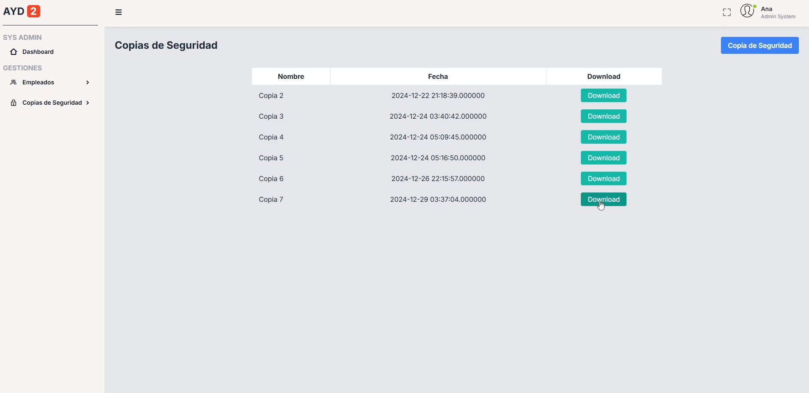

# Manual de Usuario

## Introducción

### Objetivo

Crear una aplicación dirigida para una institución bancaria con la finalidad de que los usuarios de la empresa puedan facilitar el uso de herramientas, teniendo funciones indispensables para cada rol de usuario existente dentro de la misma institución.

### Requerimientos

* Equipo: Cualquiera
* RAM: 200Mb de RAM
* Sistema Operativo: Windows 98 o superior
* Resolución gráfica requerida: 1920 x 1080
* Navegador: De preferencia Chrome

## Descripción de la aplicación

La aplicación es una plataforma bancaria la cual es diseñada para apoyar a todos los trabajadores (supervisores, administradores de sistemas, cajeros y personal de atención al cliente) ofreciendoles diversas funcionales para que cada tipo de usuario pueda trabajar de manera más eficiente y sin complicaciones.
La aplicación es consumida por los usuarios y los clientes (usuarios de cuentas bancarias) para los cuales se pueden registrar de diversas maneras:
* El registro de administradores de sistemas **únicamente** puede ser registrado y monitoreado por el supervisor.
* El registro de los usuarios de atención al cliente y cajeros los registrá el Administrador de sistemas.
* Los clientes que van a abrir sus cuentas bancarias, por medio del servicio de Atención al cliente, pueden abrir tanto su cuenta en quetzales, aceptar dolares para la cuenta y el poder hacer peticiones para prestamos y tarjetas.

Para los usuarios Supervisores que contarán con todas las herramientas de reportes a su mano para lo que son las tomas de desiciones importantes para la institución, es de vital importancia tambien monitorear eventos y/o ingresos y egresos de la misma institución, la cual es el banco "Money Bin Bank".

### Login

Aqui todos los usuarios de la institución podran loguearse mediante sus credenciales que son el usuario/correo y la contraseña, la cual el sistema les genera a cada usuario de manera individual.

### Dashboard

Todos los usuarios al poder ingresar con sus credenciales, el sistema los va a redireccionar a su dashboard de usuario (tomar en cuenta que las herramientas de cada rol de usuario tiene sus limitaciones o mejor dicho sus herramientas para no hacer tareas de las cuales no tienen permitido hacer)

### Creación de Usuario Administrador de Sistemas

| - | - |
| :-: | :-: |
|  |  |

El usuario supervisor al crear el administrador de sistemas, requerirá de ciertos datos o información para poder crear el usuario, una vez creado el usuario, le enviará un correo al nuevo administrador de sistemas dandole su contraseña de usuario (generada por el sistema), como la contraseña de 2 pasos (2FA para abreviar).

### Creación de Usuario

| - | - |
| :-: | :-: |
|  |  |

El administrador de sistemas al igual que el administrador (el administrador no registra empleados que no sean el administrador de sistemas), se encarga de registrar los empleados tambien utilizando los datos de cada usuario, una vez lleno los campos y lo que es la papelería del usuario, corresponde el envio de correo del usuario y la contraseña generada por el sistema para dicho usuario.

### Asignación de Roles

| - | - |
| :-: | :-: |
|  |  |

El administrador de sistemas le da un rol específico a cada usuario que esta en el sistema (usuarios empleados), todo ello tiene el fin de organizar a cada usuario para sus correspondientes tareas y/o deberes para llevar a cabo.

### Creación Cuenta Cliente

| - | - | - |
| :-: | :-: | :-: |
|  |  |  |

Para lo que es la creación de cuentas (la cual se hace por medio de los usuario de atención al cliente), esta pedira los datos necesarios e incluso una pregunta de seguridad para cada usuario que se quiera registrar y quiera utilizar los servicios de Money Bin Bank.

### Depositar en cuenta

| - |
| :-: |
|  |

Para los usuarios de Cajeros quienes se encargarán de hacer los depositos de los usuarios clientes para ya sea una cuenta que ellos tienen u otra cuenta que es de otra persona.

### Búsqueda de usuario & Transacciones

| - |
| :-: |
|  |

En este módulo el usuario cajero por medio del cliente lo utlilizará para la obtención de sus datos y transacciones, sin mencionar el saldo con el que cuenta y la fecha más reciente en el que ha hecho alguna transacción.

### Actividad en Tiempo Real

| - |
| :-: |
|  |

En éste módulo se miran a tiempo real todas las transacciones realizadas por los usuarios clientes y tambien la actividad que está realizando el administrador de sistemas.

### Copias de Seguridad

| - | - |
| :-: | :-: |
|  |  |

El administrador de sistemas se encarga de la generación de copias de seguridad de la base de datos para tener un resguardo de la información.
